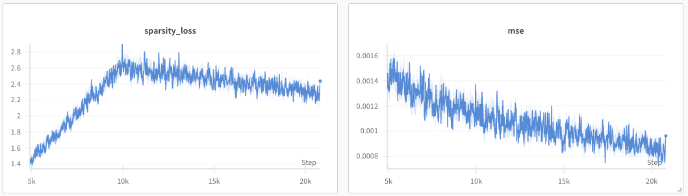

# nanoSAE

[](https://github.com/gwenlake/nanoSAE)
[](https://github.com/gwenlake/nanoSAE/blob/main/LICENSE)
[](https://www.python.org/downloads/)

nanoSAE is a simple and fast Python library for training Sparse Autoencoders (SAEs) for semantic analysis.

It is the results of work carried out by the Gwenlake team (Sylvain Barthélémy, Guillaume Béguec, Antoine de Parthenay, and Elsa Doyen) as part of our investigation into the use of Sparse Autoencoders (SAEs) for semantic analysis.

These efforts build directly upon Anthropic's research, as detailed in the *"Towards Monosemanticity"* article series, which explores applying SAEs to the semantic interpretation of large language models via a dictionary-learning methodology.


## What can nanoSAE do?

This repository condenses the entire sparse autoencoder workflow into a compact, high-performance package. With under a thousand lines of code, it delivers a fast, optimized training loop alongside boilerplate for logging, checkpoints, and configuration.

Beyond training, you gain comprehensive semantic‐analysis tools and visualization utilities that reveal activations, weight distributions, and learned structures at every stage. Whether you’re running large‐scale experiments, tuning hyperparameters, or digging deep into model behavior, this platform provides a simple yet powerful foundation for both rapid prototyping and rigorous research.



## Installation

```bash
pip install git+https://github.com/gwenlake/nanoSAE
```

## Training a Sparse Autoencoder

```python
import pandas as pd
import torch
from nanosae import SAETrainer, TrainConfig

# Load your dataset
data = pd.read_csv("dataset.csv")

# Configure the training parameters
train_cfg = TrainConfig(
    input_size=1024,
    hidden_size=4096,  # Number of features to learn
    l1_coefficient=0.001  # Sparsity coefficient
)

# Initialize the trainer
trainer = SAETrainer(config=train_cfg)

# Train the model
model = trainer.train(data=data)

# Save the trained model
torch.save(model, "sae.pt")
```

## Get features from a trained model

```python
import torch
from nanosae import SAEModel

# Load the trained model
model = torch.load("sae.pt")

# Process new data
features = model.features(data)
```

## Acknowledgements

Built on Anthropic’s “Towards Semanticity” research—most notably their April 2024 update on training sparse autoencoders—this code adapts the excellent [Dictionary Learning library](https://github.com/saprmarks/dictionary_learning) to deliver a high-performance SAE implementation. It incorporates Anthropic’s own SAE training recipes from their April 2024 update ([Training SAEs](https://transformer-circuits.pub/2024/april-update/index.html#training-saes)) alongside key techniques from ["Disentangling Dense Embeddings with Sparse Autoencoders"](https://arxiv.org/abs/2408.00657), especially the feature-analysis methodology.


## Citation

If you use nanoSAE in your research, please cite it as follows:

```bibtex
@misc{gwenlakenanosae2025codebase,
   title = {nanoSAE},
   author = {Sylvain Barthélémy, Guillaume Béguec, Antoine de Parthenay, and Elsa Doyen},
   year = {2025},
   howpublished = {\url{https://github.com/gwenlake/nanoSAE}},
}
```
